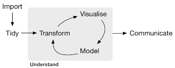

# Part I:  The IDE


# Part I:  The IDE
## Visual Studio with R Tools


# Part I:  The IDE
## Interactive R
Try
```{r, results='hide'}
x = 2
x <- 3
4 -> x # note: nobody does this
y = sqrt(x)
```
and see how this affect _Variable Explorer_ window.  

**Note:** Can press up-arrow to repeat previous command

# Part I:  The IDE
## Help
Try 
```{r eval=FALSE}
?sqrt
?lm
?hist
```

# Part I:  The IDE
## Plots
Try the example from ?hist
```{r}
hist(sqrt(islands), breaks = 12)
```

# Part I:  The IDE
## Help examples
```{r, results='hide'}
example("lm")
```
...though this one screws up the way plots are shown, forever after asking for a prompt.  Fix by going 
```{r, results='hide'}
par(ask = FALSE)
```

# Part II:  Data Structures
## Vectors
```{r, results='hide'}
v = c(10, 11, 12, 13, 14)
v # on its own should return the result
v[2]
v[-2]
v[3]
v[c(2, 3)]
v[ - c(2, 3)]
v == 12
v > 12
v %% 2
v %% 2 == 0
v - 10
which(v > 2)
v[which(v > 2)]
```

# Part II:  Data Structures
## Vectors using seq() function and :
```{r, results='hide'}
y <- 1:4
pi:10
10:pi
seq(from = 2, to = 8, by = 2)
seq(from = 0, to = 1, length = 11)
```

# Part II:  Data Structures
## Vectors using rep()
```{r, results='hide'}
rep(x = c(1, 2, 3, 4), times = 2)
rep(x = c(1, 2, 3, 4), each = 2)
rep(x = 1:4, each = 4)
rep(x = 1:4, times = 10)
rep(x = 1:4, times = 1:4)
```

# Part II:  Data Structures
## Vectors arithmetic
```{r, results='hide'}
c(1, 2, 3, 4) / 2
c(1, 2, 3, 4) / c(4, 3, 2, 1)
c(2, 4, 6, 8) / c(2, 3)
```

# Part II:  Data Structures
## Vectors functions to try
```{r, results='hide'}
length(v)
sum(v)
mean(v) # Also try median(v), prod(v), cumsum(v), 
cumprod(v) # Can use cumprod(1 + r) to compute an index 
#            from a return time series r.
names(v) = c("one", "two", "three", "four", "five")
v  # v is now indexed:  try v["one"]
c(v,v)
unique(c(v,v))
sort(c(v,v))
v %in% c(10, 12)
```

# Part II:  Data Structures
## Lists
```{r, results='hide'}
mylist <- list(c("Fred", "Bill", "Martha"), 
               age = c(23,29,42,50))

mylist[[2]]
mylist[["age"]]
mylist$age # this should have an autocomplete
```

# Part II:  Data Structures
## Matrices
```{r, results='hide'}
cells <- c(1,10,26,24,68,45)
rnames <- c("R1", "R2")
cnames <- c("C1", "C2", "C3")
mymatrix <- matrix(cells, nrow =2, ncol = 3,
       byrow=TRUE, dimnames=list(rnames, cnames))
```
I have yet to use these, but rest assured that matrix algebra works in R... Will be useful as we do more advanced portfolio optimisation work...

# Part II:  Data Structures
## Dataframes
```{r eval=FALSE, results='hide'}
data()
data(iris)
summary(iris)  # use Variable Explorer to view
```

# Part III:  Data Science Life cycle


# Part IV:  R at CI
Clone ci-factor_model from my GitHub account:  

https://github.com/lebelinoz/ci-factor_model